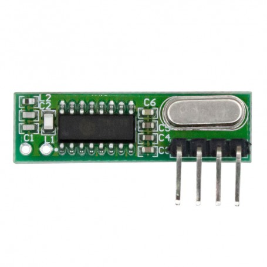
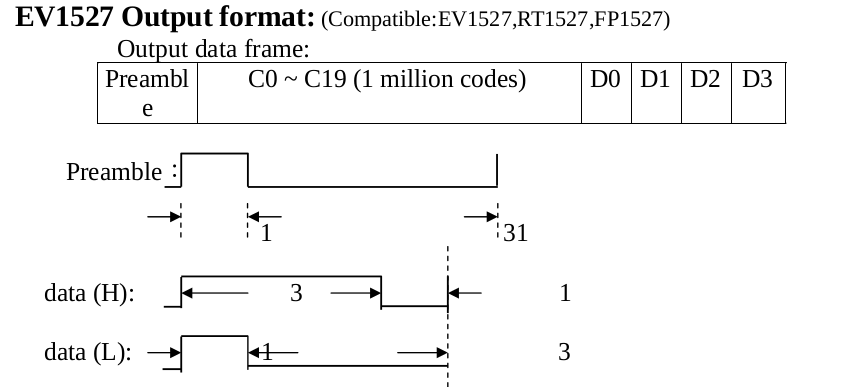
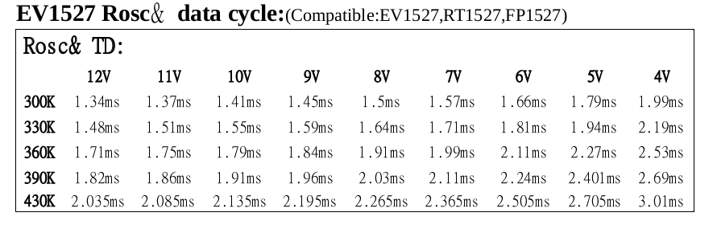

# RFremote_decoder
A lightweight library for decoding EV1527, HS1527 RF remote 433/315 MHz signals using GPIO_EXTI and timer counter. Originally written for STM32F103, but easily portable to other microcontrollers.


## 📡 Overview

- Supports 433 MHz RF transmitters based on the EV1527 protocol.
- Decodes 24-bit Remote ID + 2-bit Command.
- Interrupt-based, non-blocking design.
- Written for STM32F103 (HAL/LL), but easy to port to other MCUs.

## 🔧 Porting

To port this library to a different microcontroller, you need to adapt:

- **GPIO input**: to connect the RF receiver's data pin.
- **EXTI (External Interrupt)**: to capture signal edges.
- **Timer**: to measure pulse durations.

## ⚠️ Caution

> Timing accuracy is critical! Make sure your timer resolution is sufficient to distinguish between logic '0' and '1' pulse lengths in the EV1527 protocol.  
> - Timer frequency: at least 1 MHz (1 µs resolution).  
> - My SystemCoreClock is max 72 MHz because processing in the interrupt routine should **finish** before the next interrupt arrives.


## 🚀 Usage


### 🔧 Interrupt Handler
```c
void EXTI3_IRQHandler(void)
{
  /* USER CODE BEGIN EXTI3_IRQn 0 */

  if (LL_EXTI_IsActiveFlag_0_31(LL_EXTI_LINE_3) != RESET)
  {
    LL_EXTI_ClearFlag_0_31(LL_EXTI_LINE_3);
    
    uint32_t cnt = timer_counter_getValue();
    timer_counter_reset();
    bool edgeType = LL_GPIO_IsInputPinSet(GPIOA, LL_GPIO_PIN_3);
    RFremote_callBack(cnt, edgeType);
  }

}
```
### 🔧 Main
```c
#include "RFremote.h"

RFremotePacket_t packet;

if (RFremote_getPacket(&packet))
{
    printf("Remote ID: %d, CMD: %d\n", packet.remoteID, packet.remoteCMD);
}
```

## 🧠 EV1527


 - Signal stream starts with a preamble, followed by 24 bits of data: the 2 least significant bits are command bits, and the rest is a unique remote ID.



 - resistor conncected to oscillator pin of EV1527 afect on pulse length.
 - worst case is 3.01ms for whole packet
 - whole packet size is: (31+1) + 24(3+1) = 128 pulses
 - 3.01ms / 128 = 10us --->> so this is why 1MHz ~ 1us timer is sutable
  
  ## 💡 Advice:
Use a logic analyzer for better insight.